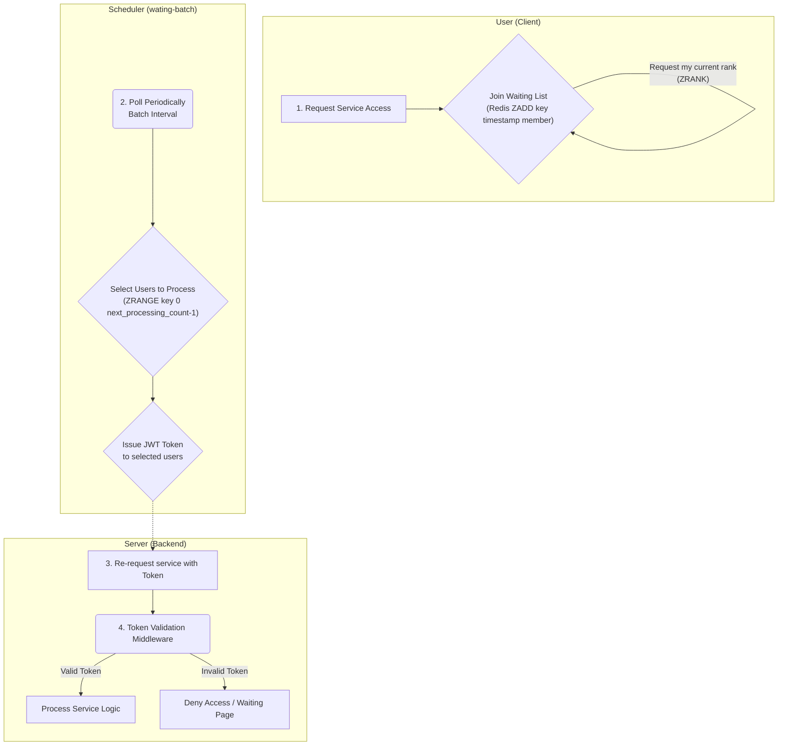

# Simple Waiting List System

This project implements a simple waiting list system. Users can join a queue, periodically check their status, and once they are at the front of the queue, receive a JWT token to access a protected resource.

## Features

-   Join a waiting list.
-   Check your position in the queue.
-   Automatic status updates every 2 seconds.
-   Receive a JWT token when you reach the front of the queue.
-   Access a protected route using the acquired token.
-   Frontend built with Next.js for a modern, reactive user experience.
-   Backend powered by Node.js and Express.
-   Redis used for efficiently managing the waiting list.

## Tech Stack

-   **Database**: Redis, PostgreSQL
-   **Backend**: Express.js
-   **Frontend**: Next.js (React)
-   **Containerization**: Docker (for Redis/Postgres)

## Architecture

The system consists of a frontend application, a backend API, a waiting list batch processor, and a database.

1.  A user requests access to the service and is added to a waiting list in Redis (`ZADD`).
2.  The user's client polls the backend to check their current rank in the queue (`ZRANK`).
3.  A separate batch process (`wating-batch`) runs periodically. It takes a set number of users from the front of the queue and generates JWT tokens for them.
4.  Once a user receives a token, they can re-request the service with the token.
5.  A middleware on the backend validates the JWT. If the token is valid, the user is granted access to the service.



## Getting Started

Follow these instructions to get the project up and running on your local machine.

### Prerequisites

-   [Node.js](https://nodejs.org/) (v18 or later recommended)
-   [Docker](https://www.docker.com/get-started) and Docker Compose

### Installation & Setup

1.  **Start Services with Docker:**
    This command will start the Redis and PostgreSQL containers.

    ```bash
    docker-compose up -d
    ```

2.  **Install Backend Dependencies:**
    Navigate to the `backend` directory and install the required npm packages.

    ```bash
    cd backend
    npm install
    ```

3.  **Install Frontend Dependencies:**
    Navigate to the `frontend` directory and install the required npm packages.

    ```bash
    cd ../frontend
    npm install
    ```

4.  **Install Batch Processor Dependencies:**
    Navigate to the `wating-batch` directory and install the required npm packages.

    ```bash
    cd ../wating-batch
    npm install
    ```

### Running the Application

1.  **Start the Backend Server:**
    In the `backend` directory:

    ```bash
    npm start
    ```
    The backend will be running on `http://localhost:3000`.

2.  **Start the Frontend Development Server:**
    In a separate terminal, from the `frontend` directory:

    ```bash
    npm run dev
    ```
    The frontend will be available at `http://localhost:3001` (or another port if 3001 is in use).

3.  **Run the Waiting List Batch Processor:**
    In a third terminal, from the `wating-batch` directory:
    ```bash
    npm start
    ```
    This script will periodically take users from the waiting list and assign them tokens.

## API Endpoints

### Reservation Service (`/reservation`)

-   **`GET /reservation`**
    -   **Description**: Checks user authentication via JWT and returns a greeting with user information.
    -   **Middleware**: `tokenCheckMiddleware`

### Waiting Service (`/waiting`)

-   **`GET /waiting/check`**
    -   **Description**: Checks the waiting list status for a given `userId`. Returns the user's rank, total waiting count, a token (if present), and the number of users being processed.
    -   **Query Parameters**: `userId`

-   **`POST /waiting/add`**
    -   **Description**: Adds a user to the waiting list.
    -   **Request Body**: `{ "userId": "string" }`

## Project Structure

```
.
├── docker-compose.yml     # Docker configuration for Redis and Postgres
├── README.md              # This file
├── backend/               # Node.js/Express backend application
│   ├── app.js             # Express app configuration
│   ├── package.json
│   ├── middleware/
│   ├── routes/            # API route definitions
│   └── utils/
├── frontend/              # Next.js frontend application
│   ├── src/app/           # App Router pages and components
│   └── package.json
├── postgres_data/         # Data persistence for Postgres container
└── wating-batch/          # Batch process for issuing tokens
    ├── processing.js      # Main batch processing logic
    └── package.json
```
